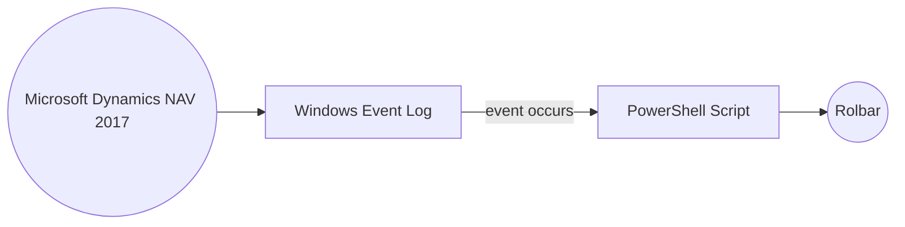

# Integrating Dynamics NAV 2017 Error to Rollbar
_Rollbar_ provides real-time error tracking & debugging tools for developers. JavaScript, PHP, Ruby, Python, Node.js, Android, iOS & more languages supported. Rollbar supports .net integration which would require custom coding in every objects. However, if the debuging is enabled on Dynamics NAV administration screen, you will get all the errors logged into the windows event viewer. This powershell script will be triggered when an event occurs and sends an POST request to Rollbar API. 

